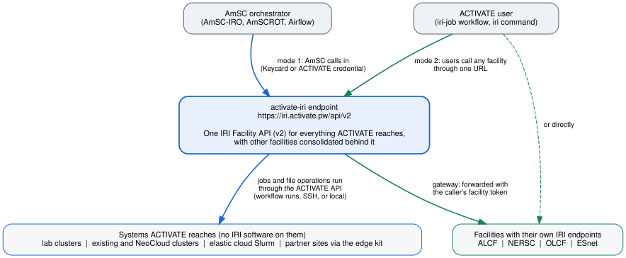

# activate-iri

Parallel Works ACTIVATE as a DOE Integrated Research Infrastructure (IRI) facility, and ACTIVATE as a consumer of IRI facilities. This repository holds the design, the reference implementation, and the deployment kits that connect ACTIVATE (commercial platform and the High Security Platform) with the American Science Cloud, the IRI Facility API v2, and the Genesis Mission platform.

| Directory | What it is |
|---|---|
| `docs/INTEGRATION_PLAN.md` | The integration plan: surfaces, resource and identity model, facility readiness, secure-enclave path, verification status, phased schedule |
| `docs/ARCHITECTURE.md` | Architecture with diagrams: the two modes and the gateway, request path, identity, job and filesystem sequences, routing, edge kit, resource model, status ledger, topology dashboard |
| `docs/DEPLOYMENT.md` | Choosing a shape, federation and edge deployment, gateway configuration, platform workflows, prototype runbook |
| `activate-iri/` | IRI Facility API v2 adapters over ACTIVATE. Federation mode publishes everything the platform operates; edge mode runs on the login node of a single existing cluster. Tests, offline demo, edge install kit, federation manifests |
| `activate-iri-connector/` | ACTIVATE workflow that submits PSI/J jobs to any IRI facility; cross-facility status board |
| `amscrot-activate/` | AmSCROT service client so AmSC orchestration can drive ACTIVATE natively |
| `prototype/` | The running prototype: facility file, scripts to run and publish the endpoint through `pw endpoints`, and a live smoke test |
| `iri-topology/` | Facilities topology dashboard: aggregates IRI endpoints into the status-monitor topology format and serves the map |

Run the reference implementation offline, no platform account needed:

    cd activate-iri && make venv && make test && make demo

Current prototype status is recorded in `prototype/NOTES.md`.

License: MIT. Copyright (c) 2026 Parallel Works, Inc.
