# Architecture

How activate-iri exposes Parallel Works ACTIVATE as a DOE IRI Facility API v2 facility, routes work to connected systems, consolidates other facilities under one endpoint, and lets ACTIVATE users call IRI facilities. Diagrams are Mermaid and render on GitHub; the plan in `INTEGRATION_PLAN.md` explains why these shapes were chosen.

## 1. The two modes and the gateway

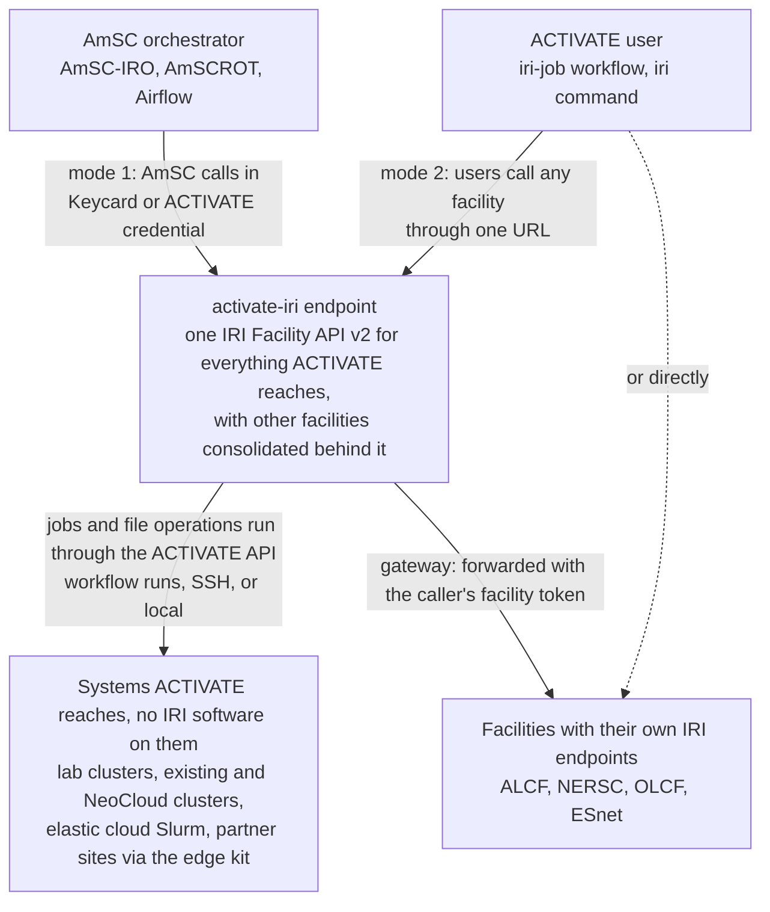

Mode 1 (outbound): AmSC and its orchestrator reach many ACTIVATE-connected systems through one endpoint, using the ACTIVATE API rather than facility-side software. Mode 2 (inbound): ACTIVATE users reach IRI facilities from their own account. Gateway mode: the same endpoint also fronts the lab facilities, so a client needs one base URL.

## 2. Request path inside the endpoint

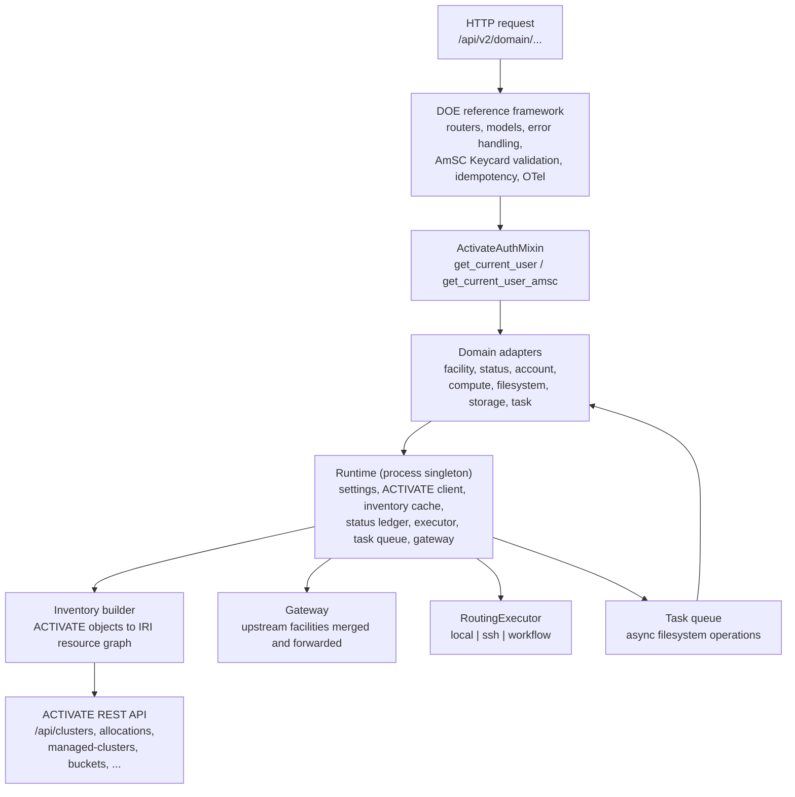

The framework owns the contract; the adapters own the mapping to ACTIVATE. Every domain adapter is loaded through `IRI_API_ADAPTER_<domain>`, so a facility can replace one domain at a time.

## 3. Identity

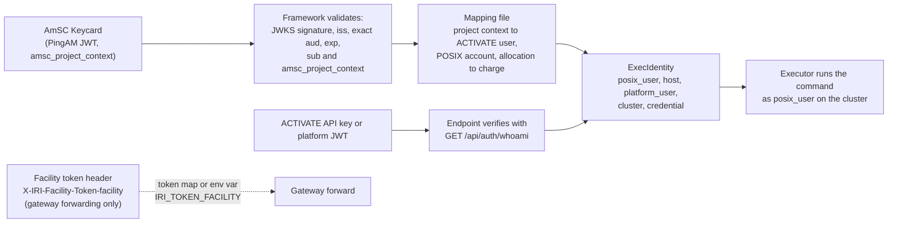

An unmapped AmSC project is a 401, as the framework requires. In the single-account configuration every run uses the endpoint's service credential; a caller who presents an ACTIVATE credential carries it in `ExecIdentity.credential`, and the workflow executor sets `PW_API_KEY` from it so the run lands in that caller's account. That is the per-user extension, already wired.

## 4. Job submission and status

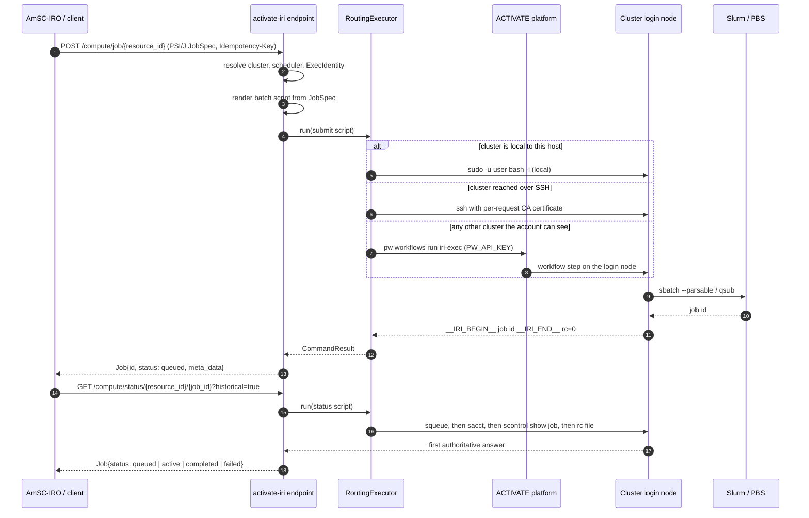

Status falls back through four sources because many clusters have no Slurm accounting database: the live queue, `sacct`, the controller's job memory (`scontrol`), and an exit-code file the batch script writes beside its submission. On a terminal state with elapsed time available, node-hours are posted to the caller's ACTIVATE allocation as a usage event.

## 5. Filesystem task loop

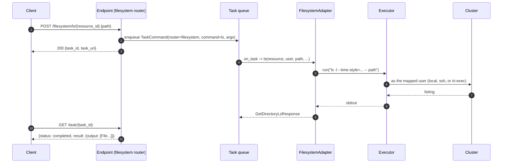

Every FirecREST-style operation is one shell script with a parser; destructive operations refuse relative paths, parent references, and protected roots before anything reaches the shell.

## 6. Routing decision

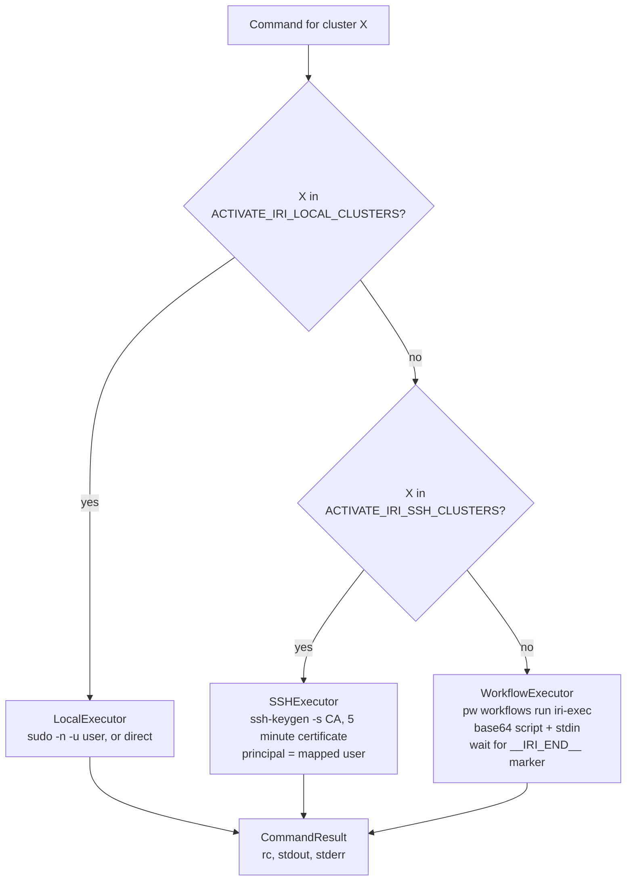

`ACTIVATE_IRI_EXECUTOR=auto` builds this router; `local`, `ssh`, or `workflow` selects one executor for everything.

## 7. Gateway mode

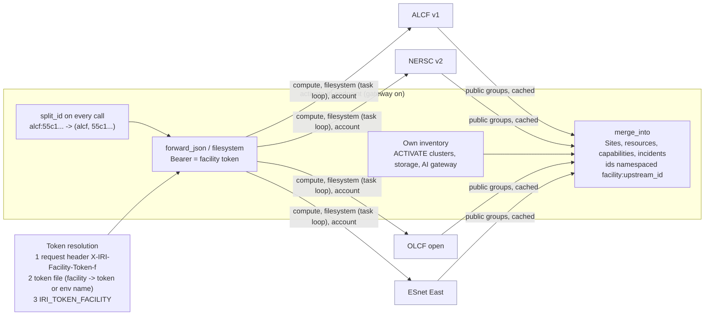

Discovery of upstream facilities needs no token. Forwarded calls need the caller's facility token; a missing token is a 401 naming the facility. Resources without a namespace are ACTIVATE's own and never leave the endpoint.

## 8. Mode 2: calling facilities from an ACTIVATE account

```mermaid
sequenceDiagram
    autonumber
    participant U as ACTIVATE user
    participant W as iri-job workflow / iri command
    participant F as IRI facility (ALCF, NERSC, PW endpoint)

    U->>W: run with facility URL, resource, PSI/J form, token variable
    W->>F: GET /compute/resources (resolve resource by name)
    W->>F: POST /compute/job/{rid} (Idempotency-Key = run id)
    loop until terminal
        W->>F: GET /compute/status/{rid}/{job}
    end
    W->>F: POST /filesystem/download/{rid} {stdout path}
    W->>F: GET /task/{id} until completed
    W-->>U: stdout in the run log; job id in XCom-style outputs
```

The same steps work for v1 facilities: the `iri` command switches filesystem verbs (v1 GET/PUT/DELETE with query parameters, v2 POST bodies) based on the base URL.

## 9. Edge kit: a facility with nothing deployed

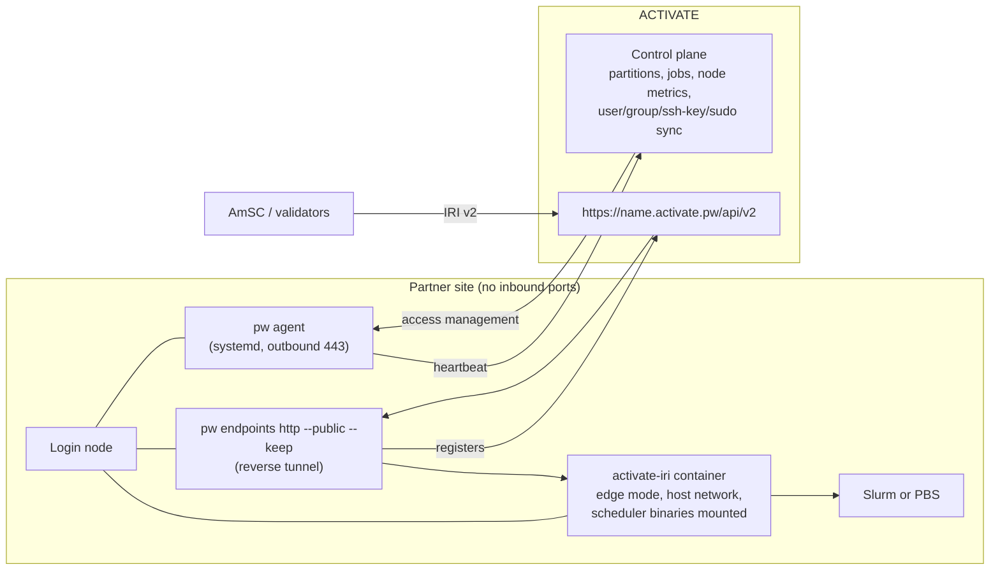

`deploy/edge/install-edge.sh` does all of it on one login node. The unauthenticated groups (facility, status, capabilities) are public by specification; the authenticated groups validate their own bearer tokens.

## 10. Resource model

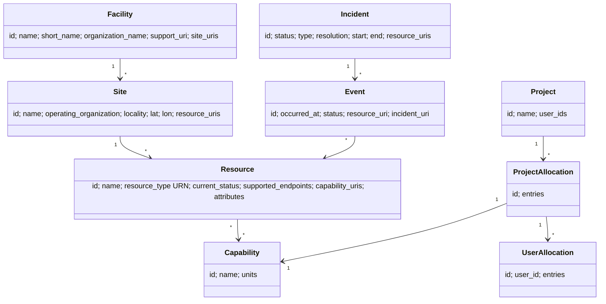

| ACTIVATE object | IRI object | Type URN |
|---|---|---|
| Cluster (any type) | Resource | `urn:doe-iri:resource:compute:system` |
| Managed-cluster partition | Capability | node-hours; GPU partitions separately |
| Node-reported filesystem, Lustre, NFS | Resource pair | `storage:filesystem` and `storage:mount` |
| Bucket | Resource plus AccessEndpoint | `storage:object` |
| AI chat provider | Resource | `service:inference` (OpenAI API) |
| Allocation | Project, ProjectAllocation, UserAllocation | node-hours or `allocation:ext:pw:credits` |
| Cluster status change, platform alert | Event, Incident | |

## 11. Status ledger

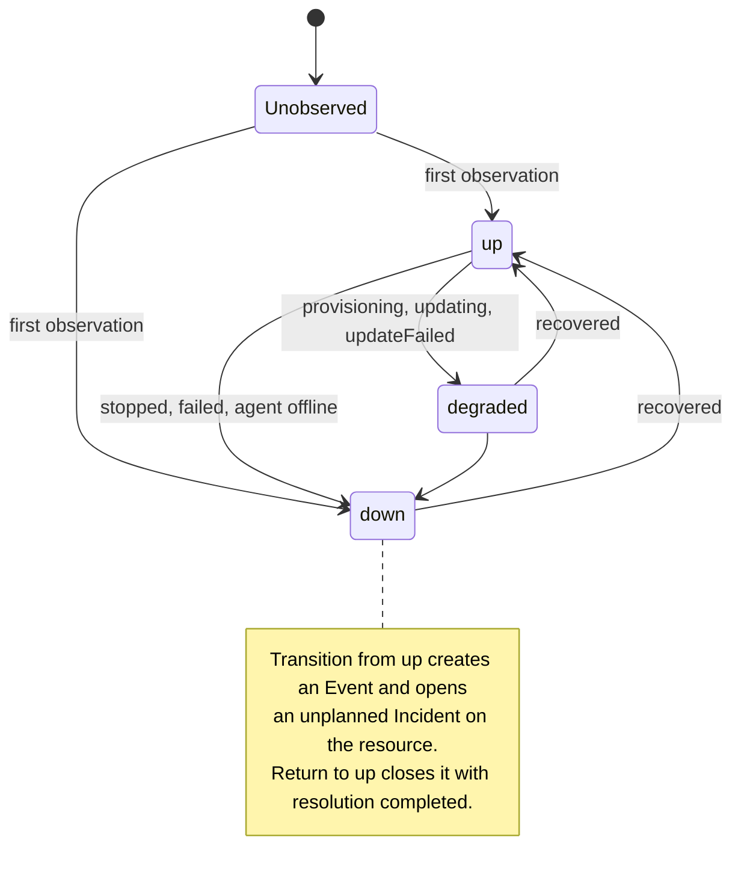

Platform alerts and maintenance mode add planned incidents across every published resource. The ledger is in-process for the prototype; a multi-replica deployment persists it.

## 12. Facilities topology dashboard

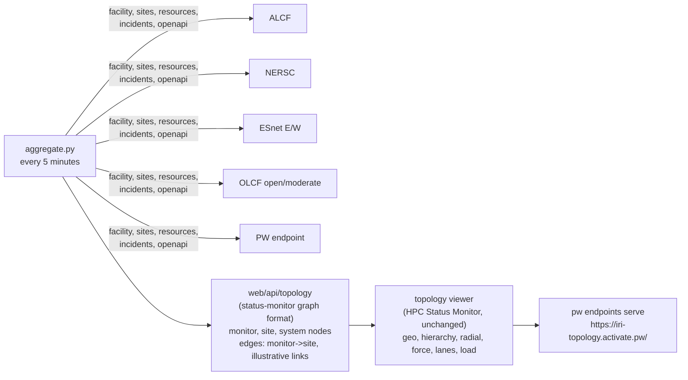

A facility counts as connected when its API answered the sweep; link speed is the HTTP round trip. Inter-site links are illustrative until a measured source exists.
