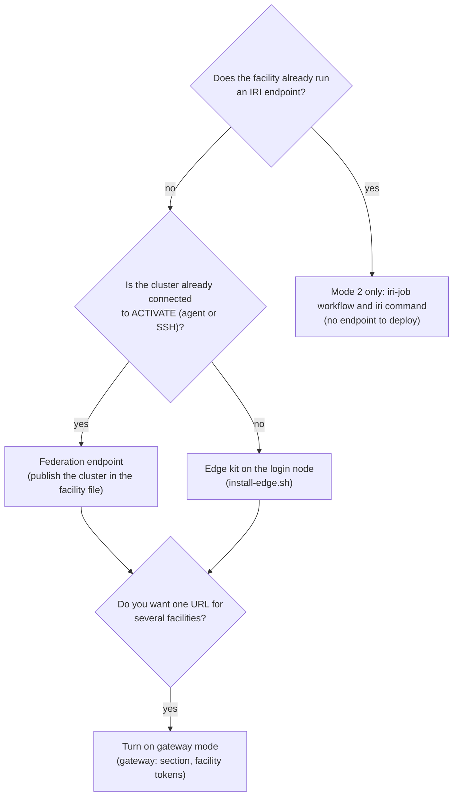

# Deployment and operations

Three ways to run activate-iri, the platform workflows it depends on, and the runbook for the prototype.

## 1. Choose a shape

## 2. Federation endpoint

Runs beside the ACTIVATE control plane (Kubernetes manifest in `activate-iri/deploy/federation/deployment.yaml`) or on any host with the pw CLI and network access to the platform.

| Setting | Value | Notes |
|---|---|---|
| `ACTIVATE_IRI_MODE` | `federation` | |
| `ACTIVATE_HOST`, `ACTIVATE_ORGANIZATION` | platform URL and org | |
| `ACTIVATE_SERVICE_API_KEY` | API key of the service account | Create it in the ACTIVATE UI; platform JWTs expire in 24 hours |
| `ACTIVATE_IRI_FACILITY_FILE` | facility file | Sites, publication allowlists, execution clusters, allocation units, gateway |
| `ACTIVATE_IRI_EXECUTOR` | `auto` | `ACTIVATE_IRI_LOCAL_CLUSTERS` and `ACTIVATE_IRI_SSH_CLUSTERS` name the exceptions; everything else uses `iri-exec` workflow runs |
| `ACTIVATE_IRI_EXEC_WORKFLOW`, `ACTIVATE_IRI_PW_BIN` | `iri-exec`, path to `pw` | The workflow must exist on the platform (section 5) |
| `ACTIVATE_IRI_SSH_CA_KEY`, `ACTIVATE_IRI_SSH_KEY`, `ACTIVATE_IRI_SSH_JUMP` | SSH executor | CA mode mints a 5 minute certificate per call |
| `API_URL_ROOT`, `API_URL` | public URL, `api/v2` | Used in every `self_uri` |
| `ACTIVATE_IRI_PUBLIC_SCHEME` | `https` | Pins the scheme in generated URIs when a tunnel or gateway forwards plain http |
| `AMSC_TOKEN_ENABLED`, `AMSC_TOKEN_ISSUER`, `AMSC_TOKEN_AUDIENCE`, `AMSC_OIDC_DISCOVERY_URL`, `AMSC_PROJECT_MAPPING_FILE` | AmSC Keycards | Audience must equal the endpoint URL exactly and be registered with AmSC |
| `IRI_IDEMPOTENCY_STORE` | `activate_iri.idempotency.InMemoryIdempotencyStore` or the Redis store | Redis for more than one replica |
| `OPENTELEMETRY_ENABLED`, `OTLP_ENDPOINT` | telemetry | Forward to the AmSC operations collector |

Facility file essentials (`activate-iri/examples/facility.federation.yaml`): `sites` with match rules (CSP, region, type, tag, name), `inventory.include_names` or `require_tag` to select what is published, `inventory.execution_clusters` to say where compute and filesystem calls are allowed, `inventory.elastic_status` for idle cloud clusters, `allocation` units, and an optional `gateway` section.

## 3. Edge kit

One login node, outbound port 443 only.

    export PW_NODE_TOKEN=...      # from the org admin: managed cluster node token
    export PW_SERVICE_API_KEY=... # service account API key for inventory reads
    export IRI_NAME=exlab-iri IRI_CLUSTER=labcluster
    sudo -E activate-iri/deploy/edge/install-edge.sh

The script installs the pw CLI, registers the node (`pw agent register --systemd`), creates the `iri` service account and a scoped sudoers rule, writes `/etc/activate-iri/env`, starts the container with host networking and the scheduler binaries mounted, and publishes it with `pw endpoints http --public --keep`. The endpoint answers at `https://<IRI_NAME>.activate.pw/api/v2`. Remove with `systemctl disable --now activate-iri-endpoint activate-iri pw-agent`.

## 4. Gateway mode

Add to the facility file:

    gateway:
      cache_ttl_seconds: 120
      token_file: /etc/activate-iri/facility-tokens.json      # optional: {"tokens": {"alcf": "IRI_TOKEN_ALCF"}}
      facilities:
        - { id: alcf,  name: Argonne Leadership Computing Facility, base_url: https://api.alcf.anl.gov/api/v1, token_env: IRI_TOKEN_ALCF }
        - { id: nersc, name: NERSC, base_url: https://api.iri.nersc.gov/api/v2, token_env: IRI_TOKEN_NERSC }

Discovery works without tokens. For forwarded calls, supply the facility token as `IRI_TOKEN_<FACILITY>` in the endpoint's environment, in the token file, or per request in `X-IRI-Facility-Token-<facility>`. Upstream resources carry ids of the form `<facility>:<upstream id>`; ACTIVATE's own resources keep plain ids.

## 5. Platform workflows

Two workflows live on the platform and are created from the repository with `pw workflows create --yaml <file> <name>` (update with `pw workflows update --yaml`):

| Workflow | File | Role |
|---|---|---|
| `iri-exec` | `activate-iri/deploy/federation/iri-exec.workflow.yaml` | Transport for the workflow executor: runs a base64 script on a cluster login node between `__IRI_BEGIN__` and `__IRI_END__` markers and prints `rc=<n>` |
| `iri-job` | `activate-iri-connector/workflow/iri-job/workflow.yaml` | Mode 2: submit a PSI/J job to any IRI facility, poll, fetch stdout |

Both validate against `https://activate.parallel.works/workflow.schema.json`. A workflow run on a managed cluster needs the platform user to exist on the node (enable user population and SSH-key sync in the cluster's access management) or an existing-cluster record with an explicit SSH user.

## 6. Prototype runbook

Location: `prototype/` on the lab cluster controller. Everything is idempotent.

    ./run.sh          # start the endpoint on 127.0.0.1:8100 (credential from the pw CLI context)
    ./publish.sh      # publish at https://activate-iri.activate.pw/ through the reverse tunnel
    ./smoke.sh        # 13-step live check including a Slurm job; exits non-zero on failure
    ./stop.sh         # stop the endpoint; --all also stops the tunnel
    ./watch.sh        # keepalive loop (detached); restarts endpoint or tunnel when down

Conformance (reports in `prototype/reports/`, not committed):

    V=/path/to/validator-venv; D=/path/to/iri-facility-api-docs
    $V/bin/python $D/verification/api-validator.py --baseurl http://127.0.0.1:8100 --checkspeccompliance \
        --official-schema $D/specification-v2/openapi/all_spec_v2.yaml --compliance-json spec.compliance.json
    IRI_API_TOKEN=12345 $V/bin/python $D/verification/api-validator.py --baseurl http://127.0.0.1:8100 \
        --schema-url http://127.0.0.1:8100/openapi.json --max-examples 10

Console and demo: every endpoint serves `/console/` (same origin, no extra hosting); `./demo_a30.sh` runs the GPU inventory demo from a terminal (`PRESET=container` runs `nvidia-smi` inside a CUDA container through Apptainer with `--nv`, set by the `apptainer-nv` custom attribute for clusters without Slurm gres).

Topology dashboard: `iri-topology/serve.sh` starts the five-minute sweep and publishes `https://iri-topology.activate.pw/`.

Logs: `prototype/logs/api.log` (endpoint), `prototype/logs/endpoint.out` (tunnel), `iri-topology/logs/`.

## 7. Operational notes

1. Replace the pw CLI token with a service API key before leaving an endpoint unattended; `run.sh` picks up an `apikey` entry automatically.
2. Keep `execution_clusters` explicit on public endpoints. Elastic cloud clusters provision on submit and cost money; publish them for discovery until spend is approved.
3. AmSC Keycard validation stays off until AmSC registers the endpoint audience and supplies the issuer and a test project context.
4. The status ledger, task queue, and idempotency store are in-process; use the Redis store and a persistent ledger for more than one replica.
5. Destructive filesystem calls refuse relative paths, parent references, and protected roots; the kernel enforces ownership because commands run as the mapped user.
