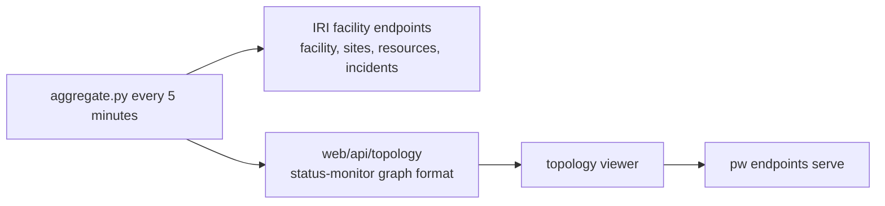

# iri-topology

A facilities topology dashboard for the DOE IRI federation, built on the topology viewer from the Parallel Works HPC Status Monitor.

`aggregate.py` reads the public groups (facility, sites, status resources, unresolved incidents, OpenAPI) of every endpoint in `facilities.yaml` and writes `web/api/topology` in the status-monitor graph format: one monitor node, one site per IRI Site pinned at the facility's coordinates, one system per compute or inference resource with status, configured capacity, and open incidents. A facility counts as connected when its API answered the sweep; latency is the HTTP round trip. The viewer is unchanged from the status monitor (geographic, hierarchy, radial, force, lane, and load layouts; grouping by site, scheduler, status, or connection). Inter-site links in `facilities.yaml` are illustrative and marked as such; they stand in for ESnet paths and cloud interconnects until a measured source exists.

    ./serve.sh        # sweeps every 5 minutes and publishes web/ at https://iri-topology.activate.pw/

Facilities configured today: ALCF, NERSC, ESnet East and West, OLCF open and moderate enclaves, and the ACTIVATE prototype endpoint. Add a facility by appending its base URL and default coordinates. Per facility, `short` sets the map label, `exclude_names` hides resources that are not systems, and `rename` shortens labels. A facility that itself runs in gateway mode is read for its own resources only; the consolidated copies of other facilities are skipped so nothing appears twice.
